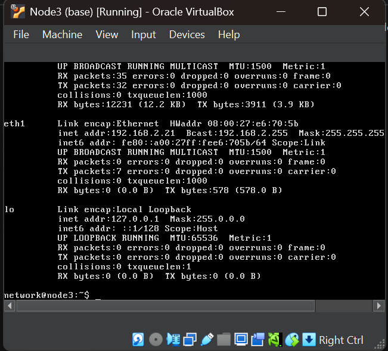
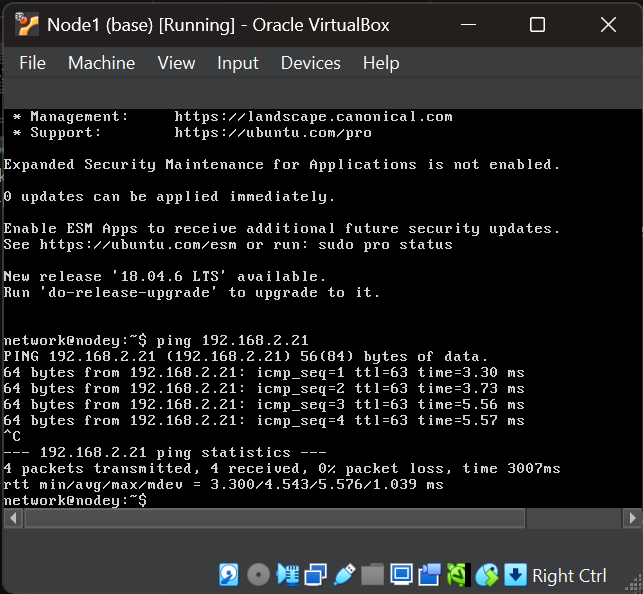
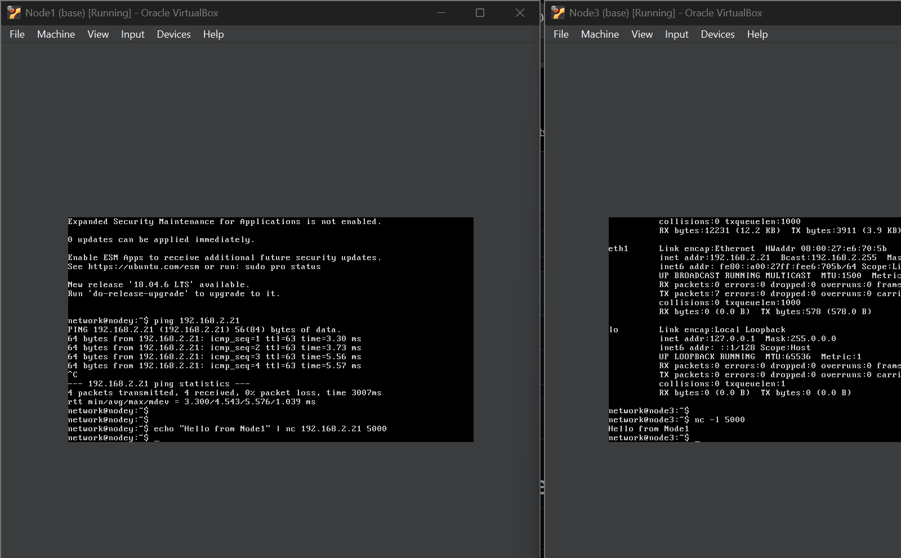

# Week 1 – Introduction to Network Security

## Overview

In Week 1, I became familiar with the virtual network environment used in COIT20262. The practical activities involved setting up the required virtual machines, checking network configuration, testing communication between nodes, transferring files, capturing network traffic, and analysing captured packets using Wireshark.

---

## Task 1 – Setup OneDrive Shared Folder

I created a OneDrive folder for COIT20262 and shared it with my tutor. This folder is used to store the required tutorial evidence and files throughout the term.

---

## Task 2 – Setup Virtnet

For the practical activities, I used the provided virtual machines in Oracle VirtualBox:

- Node1
- Node2
- Node3

I started the three nodes and logged in successfully. These machines provide the virtual network environment required for the networking and security exercises.


## Task 3 – Test the Virtual Network

### 3.1 Check Node3 IP Address

I checked the network configuration of Node3 to identify its IP addresses.

Node3 had the following relevant interface address:

```text
eth1: 192.168.2.21
```

This address was later used as the destination for connectivity testing from Node1.

### Screenshot



---

### 3.2 Test Connectivity from Node1 to Node3

I tested connectivity from Node1 to Node3 using the `ping` command:

```bash
ping 192.168.2.21
```

Node3 successfully responded to the ICMP Echo Requests. The test showed successful communication between the two nodes with no packet loss.

### Screenshot



---

### 3.3 Test TCP Communication Using Netcat

I used Netcat to test TCP communication between Node1 and Node3.

On Node3, Netcat was configured to listen on TCP port `5000`:

```bash
nc -l 5000
```

From Node1, I sent a test message to Node3:

```bash
echo "Hello from Node1" | nc 192.168.2.21 5000
```

The message was successfully received on Node3, confirming TCP communication between the nodes.

### Screenshot



---

### 3.4 Create a Text File Using Nano

On Node2, I created an example text file named:

```text
example.txt
```

The file contained:

```text
COIT20262 WEEK 1
Student ID: 12314173
This is an example text file created using nano
```

I saved the file and verified that it existed on Node2.

### Screenshot


---

### 3.5 Transfer the File Using FileZilla

I connected to Node2 using FileZilla and accessed the `/home/network` directory.

The `example.txt` file was transferred successfully from the Linux virtual machine to my Windows host computer.

### Screenshot


---

## Task 4 – Capture and Analyse Ping Traffic

### 4.1 Capture Traffic on Node2

I used `tcpdump` on Node2 to capture traffic passing through the `eth1` interface.

The command used was:

```bash
sudo tcpdump -n -i eth1 -w ping.pcap
```

While the capture was running, I generated ping traffic from Node1 to Node3.

After the ping test, I stopped the packet capture using `Ctrl + C`.

The capture reported:

```text
24 packets captured
24 packets received by filter
0 packets dropped by kernel
```

The resulting packet capture was saved as:

```text
ping.pcap
```

### Screenshot


---

### 4.2 Analyse the Capture Using Wireshark

I transferred `ping.pcap` from Node2 to my Windows computer and opened it using Wireshark.

The capture showed ICMP communication between:

```text
Node1: 192.168.1.11
Node3: 192.168.2.21
```

Wireshark displayed both:

- ICMP Echo (ping) Request
- ICMP Echo (ping) Reply

ARP traffic was also visible in the packet capture.

This confirmed that Node1 successfully communicated with Node3 and that the traffic was captured correctly on Node2.

### Screenshot


---

## Files

The following practical files were produced during this week's activities:

- `example.txt`
- `ping.pcap`

---

## Reflection

This week's practical activities helped me understand how communication can be tested and observed within a virtual network. I used Linux networking tools to identify IP addresses and verify connectivity between different nodes. Netcat demonstrated how TCP can be used to exchange data between hosts, while FileZilla allowed me to transfer files between the Linux virtual machine and my Windows computer.

The packet capture activity was particularly useful because I captured network traffic using `tcpdump` and then examined the resulting capture in Wireshark. By observing ICMP Echo Request and Echo Reply packets, I could see how a simple ping operation appears at the packet level. Overall, the practical gave me a better understanding of virtual networking, network testing, packet capture, and basic traffic analysis.
