# Week 2 – Network Attacks

## Task 1 – Capture Web Browsing

### Objective

The objective of this task was to capture and analyse HTTP web traffic using `tcpdump` and Wireshark. The MyUni demonstration website was used to observe HTTP requests and responses and to identify information transmitted through unencrypted HTTP.

### MyUni Website Setup

The MyUni demonstration website was hosted on Node3. The virtual network was configured with:

- **Node1** – Client
- **Node2** – Router and packet capture
- **Node3** – MyUni web server

The MyUni website was accessed from Node1 using:

```bash
lynx http://www.myuni.edu/grades/
```
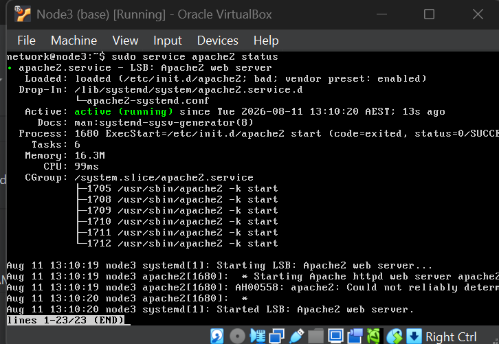
### Capturing HTTP Traffic

On Node2, `tcpdump` was used to capture the traffic generated while accessing the MyUni website.

### Accessing the MyUni Website

The MyUni web application was accessed from Node1 using Lynx. The student ID was entered into the View Grades page to generate HTTP traffic for packet capture and analysis.

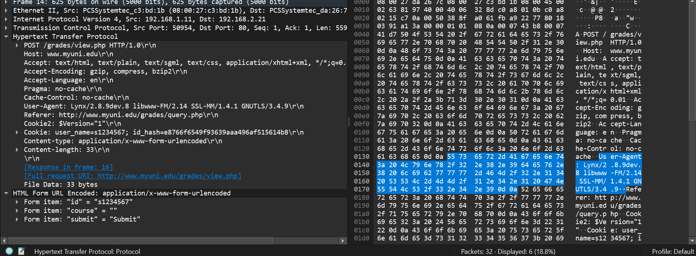
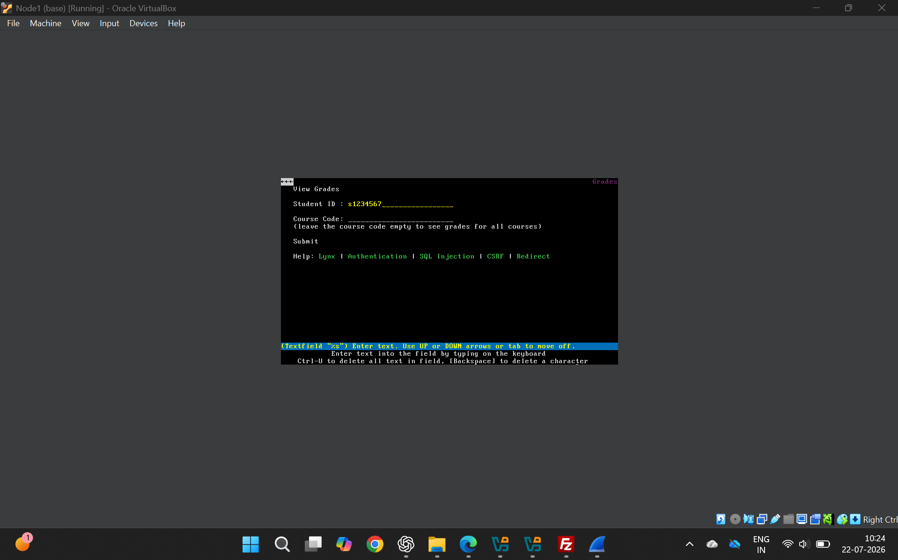

On Node2, `tcpdump` was used on the `eth1` interface to capture the network traffic generated while accessing the MyUni web application. The captured packets were saved in the `week2.pcap` file.

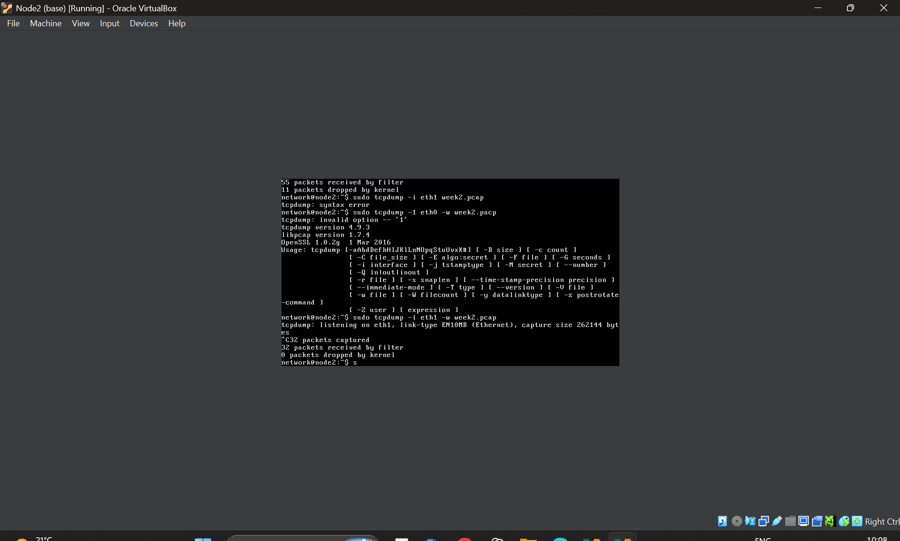
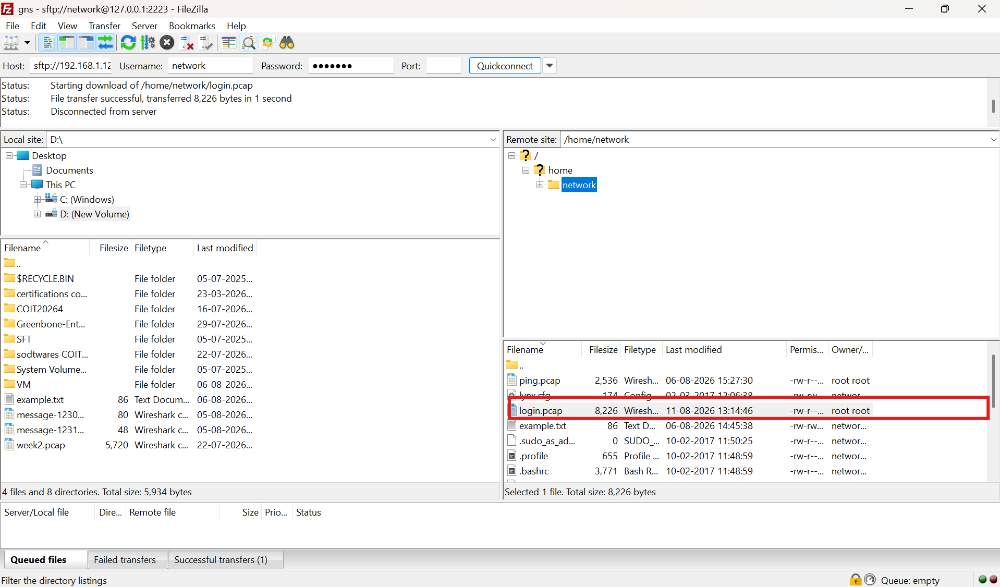

### HTTP Packet Analysis

The captured traffic showed HTTP communication between:

- **Client IP:** `192.168.1.11`
- **Web Server IP:** `192.168.2.21`
- **Protocol:** HTTP
- **Server Port:** TCP `80`

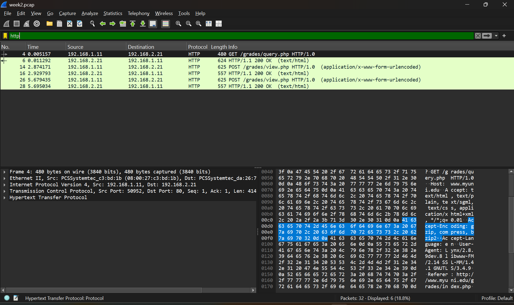

The captured packets included HTTP requests and responses such as:

```text
GET /grades/query.php HTTP/1.0
POST /grades/view.php HTTP/1.0
HTTP/1.1 200 OK
```

The HTTP response packets were inspected in Wireshark to understand the communication between the client and the MyUni web server.

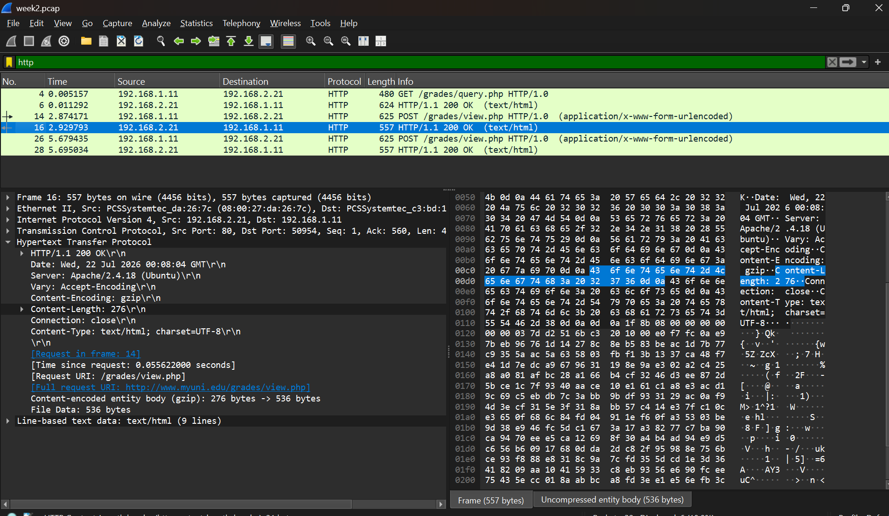

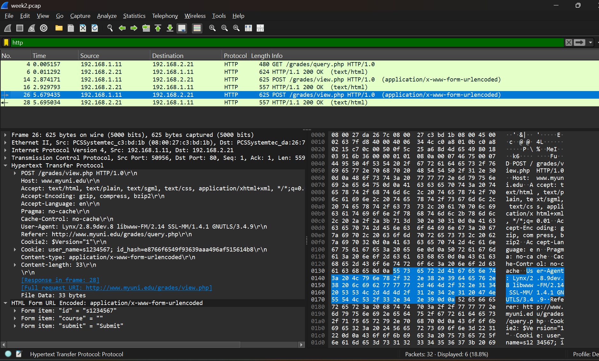

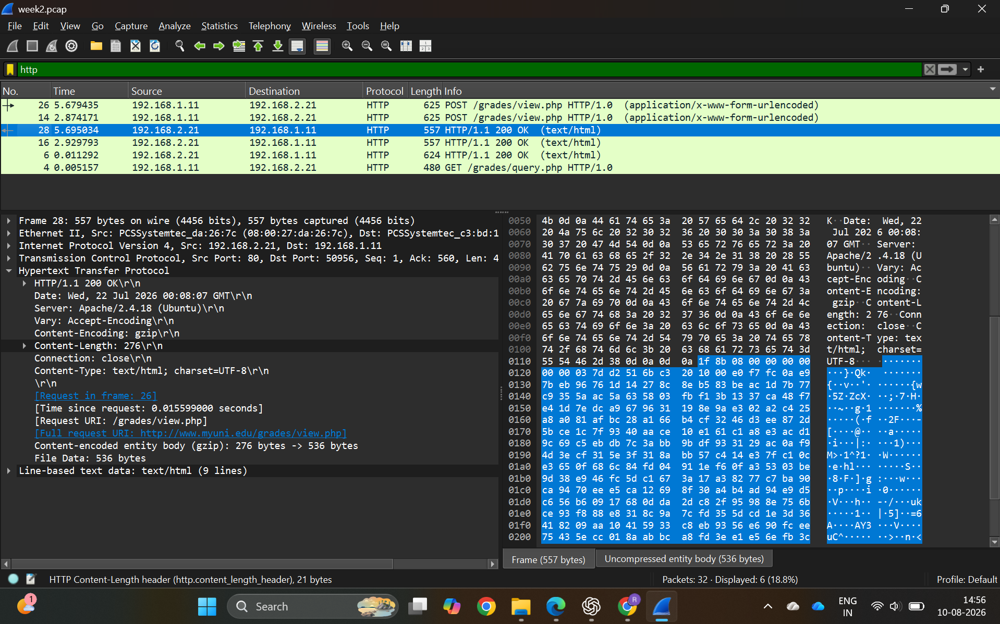

### Capturing Login Credentials

To examine the security of the HTTP login process, another packet capture was performed while submitting test login credentials through the MyUni login page.

The capture was saved as:

```text
login.pcap
```

The following Wireshark display filter was used to locate the HTTP POST request:

```text
http.request.method == "POST"
```

Wireshark identified **Packet 58**, containing:

```text
POST /grades/login.php HTTP/1.0
```

The packet was sent from `192.168.1.11` to the MyUni web server at `192.168.2.21` using TCP port `80`.

After expanding **HTML Form URL Encoded: application/x-www-form-urlencoded**, the submitted test credentials were visible:

```text
user_name = s1234567
password = password123
submit = Login
```

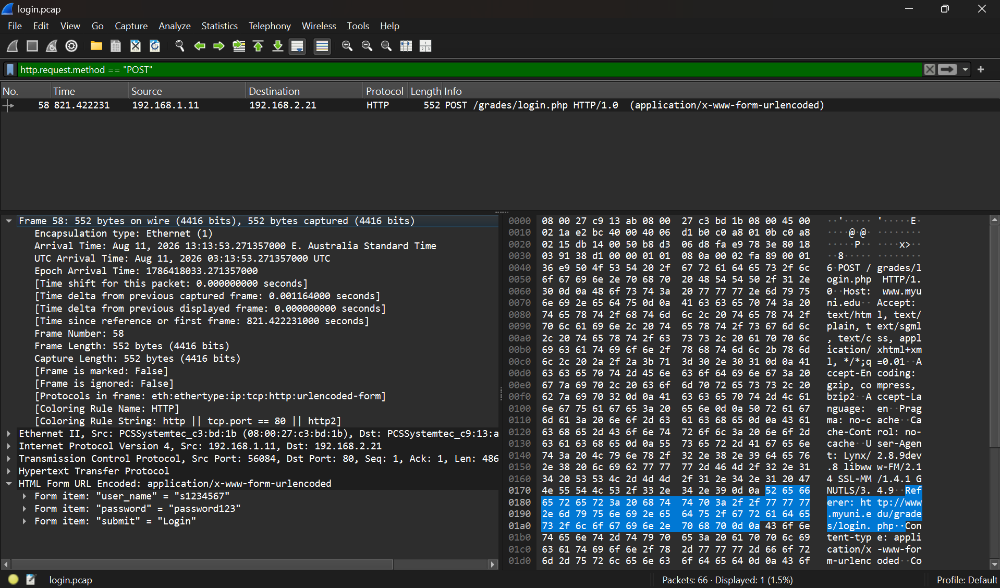

### Message Sequence

The HTTP communication observed in Wireshark followed a request-response sequence:


pppppppppppppppppppppppppppppppppppppppppppppppppppppppppppppppppppppppppppppppppppppppppppppppp


### Packet Format

The captured web traffic contained the following protocol layers:

```text
Ethernet II
     |
     v
Internet Protocol Version 4 (IPv4)
     |
     v
Transmission Control Protocol (TCP)
     |
     v
Hypertext Transfer Protocol (HTTP)
     |
     v
HTTP Form Data
```

Wireshark allowed each protocol layer and its corresponding header information to be inspected.

### Security Observation

The experiment demonstrated that information submitted through an unencrypted HTTP connection can be inspected in captured network traffic. In the login capture, the test username and password were visible directly in the HTTP POST form data.

This demonstrates why authentication and other sensitive web communication should use HTTPS rather than HTTP.

### Conclusion

This task provided practical experience using `tcpdump` and Wireshark to capture and analyse web traffic. HTTP GET and POST requests and server responses were identified in the packet capture. The experiment also demonstrated that test login credentials transmitted using unencrypted HTTP could be observed in plaintext, highlighting the importance of using encrypted HTTPS connections for sensitive web communication.

## Task 2 – TCP SYN Flood DoS Attack

### Objective
The objective of this task was to demonstrate and observe a TCP SYN flood attack in a controlled virtual lab environment using Kali Linux and Metasploitable 2.

### Lab Setup
- Kali Linux: `172.16.1.34`
- Metasploitable 2: `172.16.1.35`
- Target service: HTTP (TCP port 80)
- Network: VirtualBox Internal Network

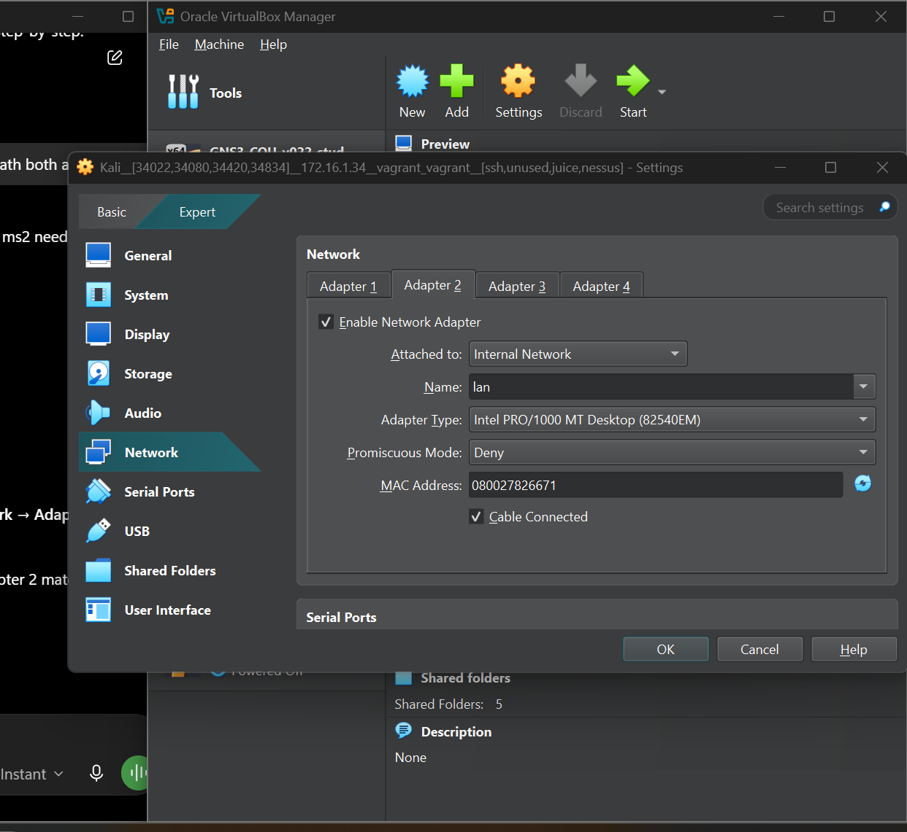

### Network Connectivity
Kali Linux and Metasploitable 2 were configured on the same internal network. Connectivity between the two virtual machines was verified successfully before conducting the experiment.

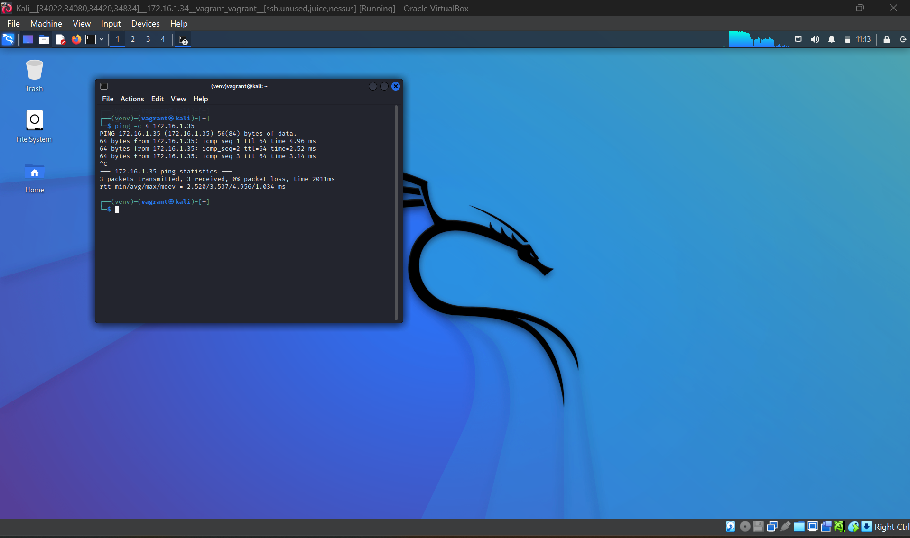

### TCP SYN Flood and Packet Detection
A TCP SYN flood was generated from Kali Linux towards the HTTP service running on Metasploitable 2. During the experiment, `tcpdump` was used on Kali to monitor the traffic on the lab network interface.

The packet capture showed a large number of TCP SYN packets (`Flags [S]`) directed towards the HTTP service. The test was stopped after the required short period using `Ctrl+C`.

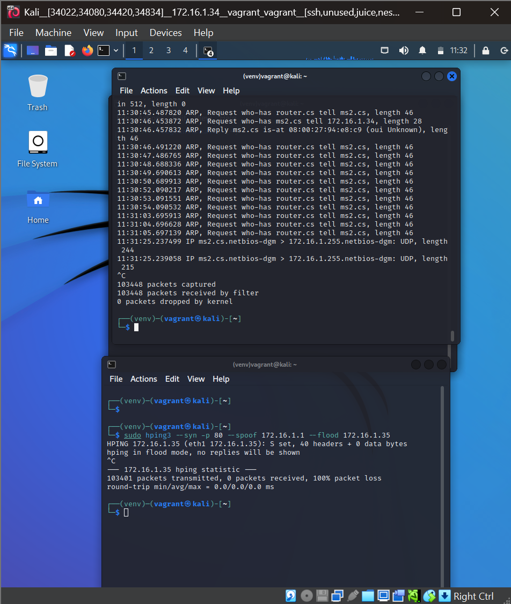

### Observing the Effect on Metasploitable 2
The web service on Metasploitable 2 was monitored using the `ss` command. Before the second test, the HTTP service was shown in the `LISTEN` state.

A second SYN flood test containing additional packet data was then performed from Kali Linux.


After the test, the HTTP service was checked again. In my experiment, the service remained in the `LISTEN` state.
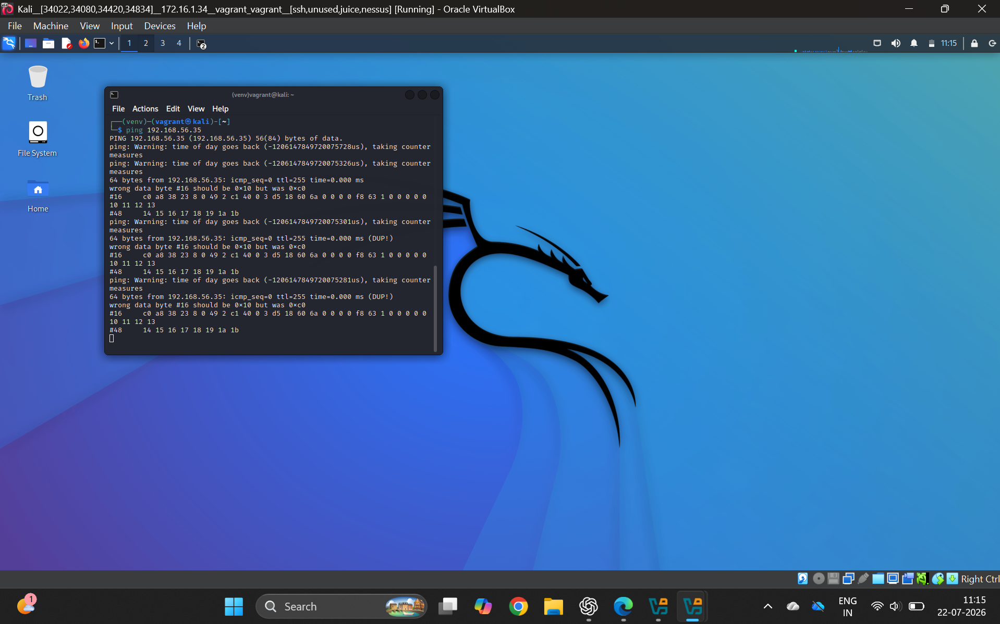
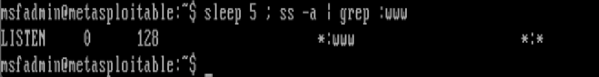

### Conclusion
This task demonstrated how a TCP SYN flood can generate a very large number of SYN packets towards a network service within a short period. Using `tcpdump` made it possible to observe the SYN traffic, while `ss` was used to monitor the HTTP service on the target machine. The experiment was performed only within the controlled VirtualBox lab environment.
