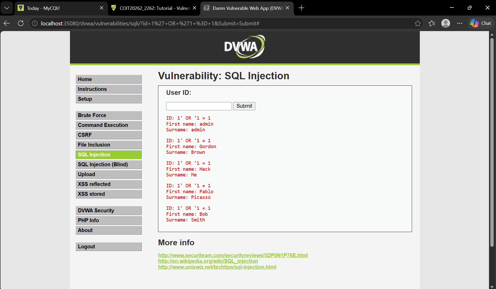

# Week 3 – Vulnerability Analysis and Web Application Security

## Task 1 – Vulnerability Analysis using Greenbone/OpenVAS

### Objective
The objective of this task was to use Greenbone/OpenVAS to scan the MS2 virtual machine, identify security vulnerabilities, examine their severity, and review possible mitigation methods.

### Procedure
I used the MS2 virtual machine with the IP address:

`192.168.56.35`

I created MS2 as a target in Greenbone and created a scan task named **MS2 Scan**. The scan used the **OpenVAS Default** scanner with the **Full and fast** scan configuration.

### Result
The vulnerability scan completed successfully and reported a maximum severity of **10.0 (High)**.

The scan identified multiple High, Medium and Low severity vulnerabilities.

I examined the **Distributed Ruby (dRuby/DRb) Multiple RCE Vulnerabilities**, which had a severity of **10.0 (High)**. I also reviewed the impact and mitigation information provided in the Greenbone report.

## Task 2 – SQL Injection

### Objective
The objective of this task was to demonstrate an SQL injection vulnerability using the Damn Vulnerable Web Application (DVWA) and observe how malicious input can affect a database query.

### Procedure
I started the MS2 virtual machine and accessed DVWA. After logging in, I changed the **DVWA Security** level to **Low**.

I opened the **SQL Injection** page and entered:

`1' OR '1 = 1`

### Result
The application returned multiple user records instead of a single record. This demonstrated how an SQL injection can manipulate a database query when user input is not handled securely.

## Task 3 – OWASP Top 10

### Objective
The objective of this task was to become familiar with the current OWASP Top 10 web application security risks and understand common attack scenarios.

### Procedure
I visited the OWASP website and reviewed the **OWASP Top 10:2025**.

In particular, I reviewed the top three risks and their example attack scenarios:

1. **A01:2025 – Broken Access Control**
2. **A02:2025 – Security Misconfiguration**
3. **A03:2025 – Software Supply Chain Failures**

## Week 3 Summary

During Week 3, I gained practical experience in vulnerability assessment and web application security. I used Greenbone/OpenVAS to scan MS2 and analyse detected vulnerabilities, demonstrated SQL injection using DVWA, and reviewed the OWASP Top 10 web application security risks.
