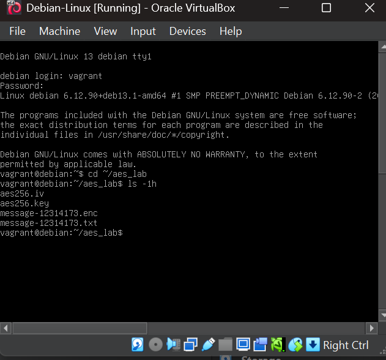
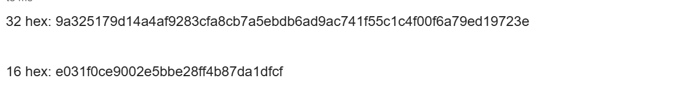
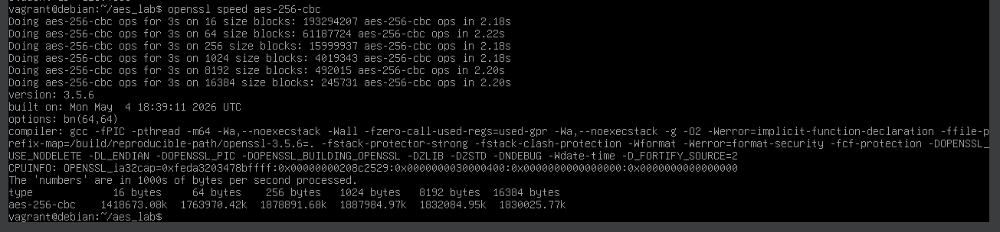

# Week 4 – Cryptography with OpenSSL and AES

## Task 1 – OpenSSL Basics

### Objective
The objective of this task was to become familiar with OpenSSL and view the cryptographic operations and commands available in OpenSSL.

### Practical Work
I used the Debian Linux virtual machine to perform the OpenSSL practical activities. After logging into the VM, I ran the following command to display the different OpenSSL commands available:

`openssl help`

The output displayed the available standard commands, message digest commands and cipher commands. It also showed cryptographic algorithms including AES, which is used in the following tasks.

### Evidence

*Figure 1: Running `openssl help` on the Debian Linux VM to view the available OpenSSL commands.*

### Result
OpenSSL was successfully accessed on the Debian Linux VM, and the available cryptographic commands and cipher operations were displayed.

## Task 2 – Symmetric Key Encryption with AES

### Objective
The objective of this task was to generate a random secret key and IV, encrypt a plaintext message using AES-256-CBC, exchange the required information with another student, and decrypt the received ciphertext.

### AES Key and IV Generation
I generated a random AES-256 secret key and a 16-byte IV using OpenSSL. These values were used for AES-256-CBC encryption and decryption.

*Figure 2: Generating the random AES secret key using OpenSSL.*

*Figure 3: Generating the random IV for AES-256-CBC.*

### Message and Encryption
I created my plaintext message file and encrypted it using AES-256-CBC with the generated key and IV. My student ID was used in the filenames.

The files created were:

- `message-12314173.txt` – plaintext message
- `message-12314173.enc` – encrypted ciphertext
- `aes256.key` – AES secret key
- `aes256.iv` – initialization vector

*Figure 4: AES key, IV, plaintext message and encrypted ciphertext files created for the AES-256-CBC practical.*

### Partner Exchange
I completed the encryption/decryption exercise with Student ID 12307888. The key and IV required for the exercise were shared, and I received the partner's encrypted ciphertext file `message-12307888.enc`.

*Figure 5: AES key and IV shared by Student ID 12307888 for the AES-256-CBC decryption exercise.*

### Decryption
I used AES-256-CBC with the corresponding key and IV to decrypt the ciphertext received from Student ID 12307888.

*Figure 6: AES-256-CBC decryption of the ciphertext received from Student ID 12307888.*

### VirtualBox Port Forwarding
I configured VirtualBox port forwarding so that the Debian virtual machine could be accessed from the host computer. Host IP `127.0.0.1` and host port `2222` were forwarded to guest port `22`.

*Figure 7: VirtualBox port forwarding configuration for SSH/SFTP access.*

### File Transfer with FileZilla
I used FileZilla with SFTP to access the Debian virtual machine. The connection used host `127.0.0.1`, port `2222`, and the `vagrant` account.

*Figure 8: FileZilla SFTP configuration used to access files on the Debian virtual machine.*

### Discussion
Sharing the secret key and IV directly with another student was convenient for this practical because both sides could use the required values for encryption and decryption. However, directly sharing a secret key is not secure if the communication method can be intercepted. If an attacker obtains the secret key, the encrypted message could be decrypted. Therefore, secret keys should be exchanged using a secure method.

### Result
I successfully generated an AES key and IV, created and encrypted my plaintext message using AES-256-CBC, exchanged ciphertext with Student ID 12307888, and performed the decryption exercise. I also configured VirtualBox port forwarding and FileZilla for transferring files between the virtual machine and host computer.

## Task 3 - Brute Force with AES

### AES-256-CBC Speed Test

I performed an AES-256-CBC speed test using OpenSSL to measure the encryption/decryption performance of the virtual machine.

Command used:

`openssl speed aes-256-cbc`

For the smallest block size of 16 bytes, OpenSSL reported approximately **223,850.23k bytes per second**, which is approximately **223,850,230 bytes per second**.

*Figure 9: OpenSSL AES-256-CBC speed test showing the performance for different block sizes.*

### Approximate Decryptions per Second

For a 16-byte block, the measured AES-256-CBC throughput was approximately **1,418,673.08k bytes per second**, which is **1,418,673,080 bytes per second**.

Therefore:

Decryptions per second = 1,418,673,080 / 16

= **88,667,067.5 decryptions per second**

Therefore, my computer can perform approximately **88.67 million AES-256-CBC decryptions per second** for a 16-byte block.

📁 [Download/View My Encrypted Message – message-12314173.enc](images/message-12314173.enc) 

📁 [Download/View Partner Encrypted Message – message-12307888.enc](images/message-12307888.enc)

## Outcomes

In Week 4, I used OpenSSL to explore cryptographic operations, performed AES-256-CBC encryption and decryption using a shared secret key and IV, exchanged encrypted data with another student, and successfully recovered the received plaintext. I also configured VirtualBox port forwarding and FileZilla for transferring files between the Debian virtual machine and host computer. Finally, I measured AES-256-CBC performance using OpenSSL and used the measured result to examine the practical difficulty of brute-forcing an AES-256 key.

