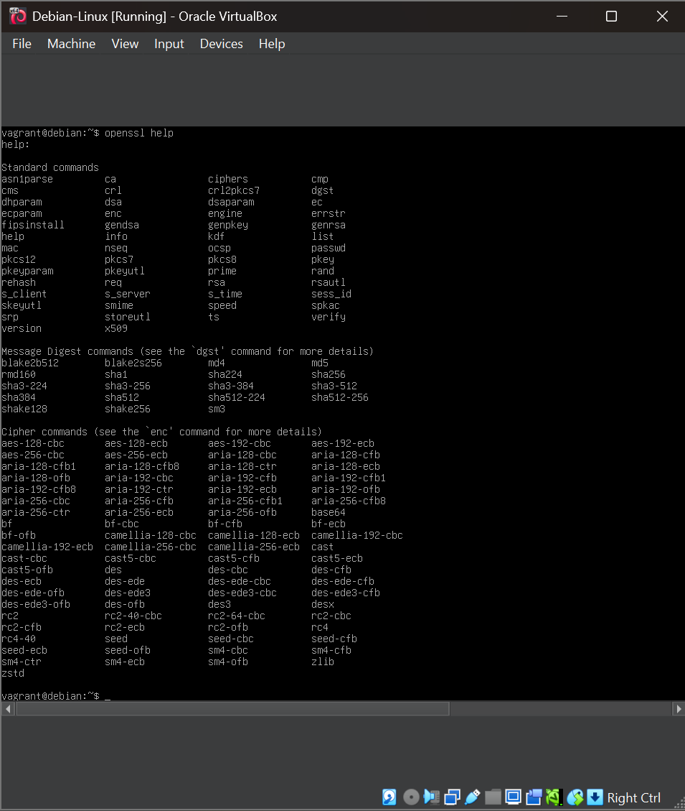
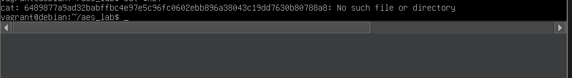
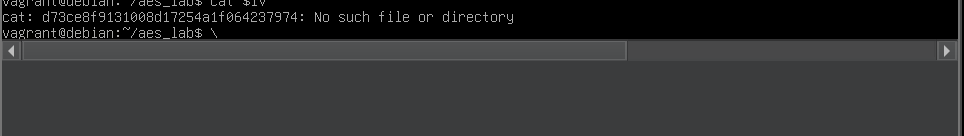
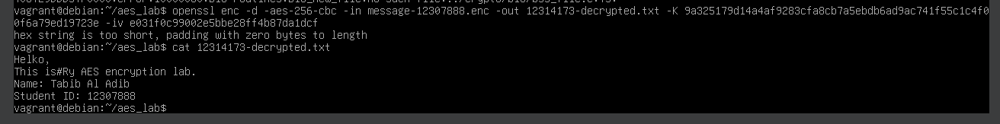
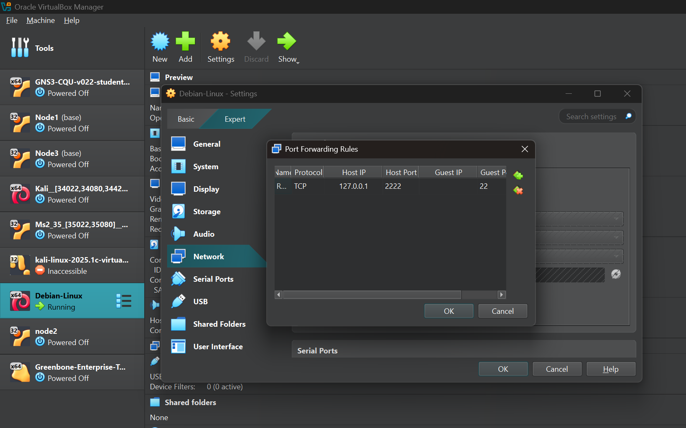
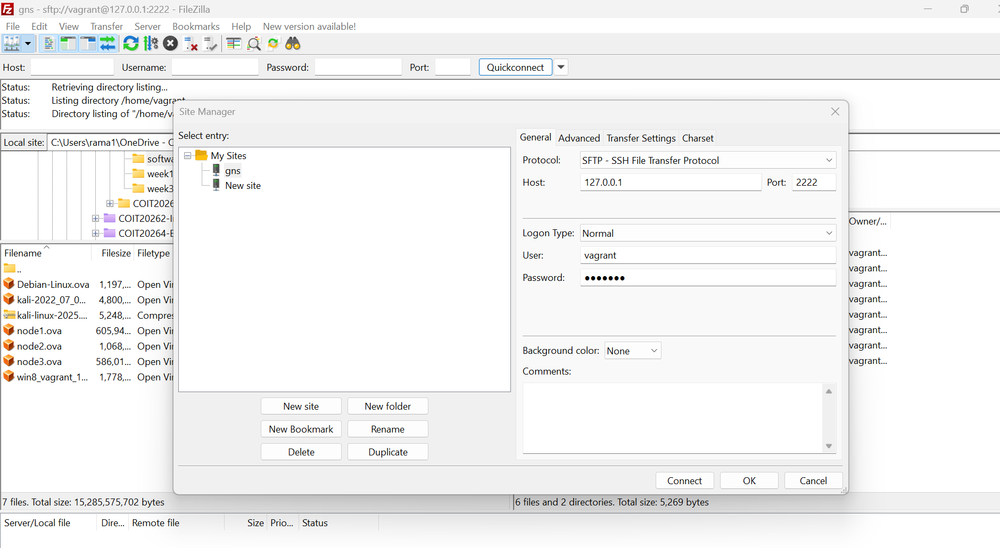

# Week 4 – Cryptography with OpenSSL and AES

## Task 1 – OpenSSL Basics

### Objective
The objective of this task was to become familiar with OpenSSL and view the cryptographic operations and commands available in OpenSSL.

### Practical Work
I used the Debian Linux virtual machine to perform the OpenSSL practical activities. After logging into the VM, I ran the following command to display the different OpenSSL commands available:

`openssl help`

The output displayed the available standard commands, message digest commands and cipher commands. It also showed cryptographic algorithms including AES, which is used in the following tasks.

### Evidence

*Figure 1: Running `openssl help` on the Debian Linux VM to view the available OpenSSL commands.*

### Result
OpenSSL was successfully accessed on the Debian Linux VM, and the available cryptographic commands and cipher operations were displayed.

## Task 2 – Symmetric Key Encryption with AES

### Objective
The objective of this task was to generate a random secret key and IV, create a plaintext message, encrypt the message using AES-256-CBC, exchange the required files with another student, and decrypt the received ciphertext.

### Generating the AES Key and IV
I generated a random 256-bit AES secret key and a 128-bit IV using OpenSSL. These values were used for AES-256-CBC encryption.

*Figure 2: Generating the random AES secret key using OpenSSL.*

*Figure 3: Generating the random IV for AES-256-CBC encryption.*

### Creating and Encrypting the Message
I created a plaintext file named `message-12314173.txt` containing my message. I then encrypted the plaintext using AES-256-CBC with the generated key and IV.

The encrypted output was saved as:

`message-12314173.enc`

*Figure 4: Encrypting my plaintext message using AES-256-CBC with the generated key and IV.*

### Key, IV and Ciphertext Exchange
For this practical, I worked with another student (Student ID: 12307888). The AES key and IV were shared as required for the practical, and encrypted ciphertext files were exchanged.

My encrypted ciphertext file was:

`message-12314173.enc`

The ciphertext I received from Student ID 12307888 was:

`message-12307888.enc`

### Decrypting the Received Ciphertext
I used AES-256-CBC with the corresponding key and IV to decrypt the ciphertext received from Student ID 12307888.

*Figure 5: Decrypting `message-12307888.enc` received from Student ID 12307888 using AES-256-CBC.*

### VirtualBox Port Forwarding
To transfer files between the host computer and virtual machine, I configured VirtualBox port forwarding. The host IP was `127.0.0.1`, host port was `2222`, and the connection was forwarded to guest port `22`.

*Figure 6: VirtualBox port forwarding configuration for SSH/SFTP file transfer.*

### File Transfer Using FileZilla
I configured FileZilla to connect to the virtual machine using SFTP. The connection used host `127.0.0.1`, port `2222`, and the `vagrant` user.

*Figure 7: FileZilla SFTP configuration used to access and transfer files from the virtual machine.*

### Discussion – Sharing the Key and IV
Sharing the secret key and IV directly with another student was convenient for this practical because both students could use the same values for encryption and decryption. However, sharing a secret key through an insecure method is not secure because anyone who obtains the key could use it to decrypt the ciphertext. A secure communication method should therefore be used when exchanging secret keys.

### Result
I successfully generated an AES key and IV, created and encrypted my plaintext message using AES-256-CBC, exchanged ciphertext with Student ID 12307888, and performed the decryption exercise. I also configured VirtualBox port forwarding and FileZilla for transferring files between the virtual machine and host computer.
