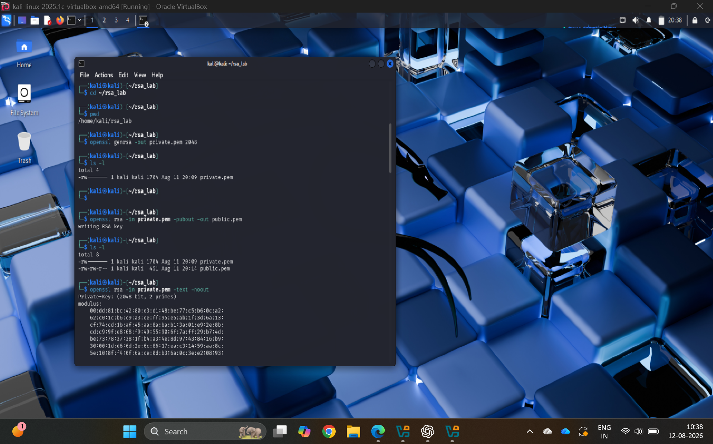
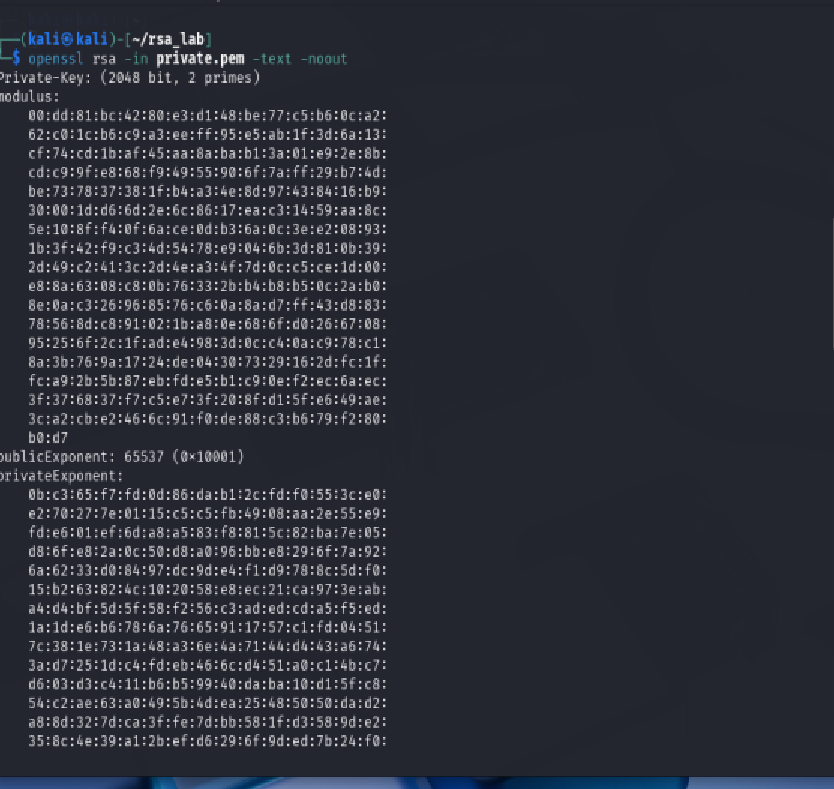
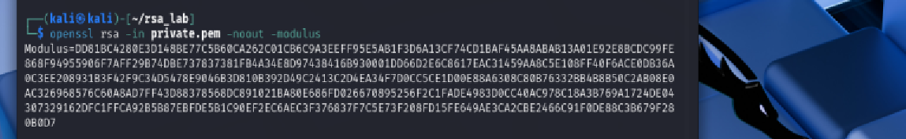
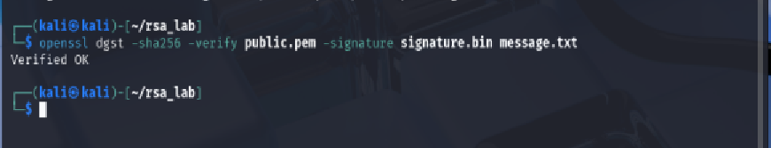
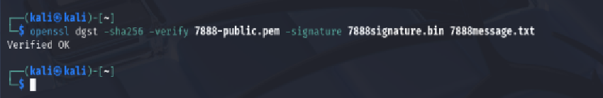

# Week 5 – Public Key Cryptography with RSA

## Introduction

In Week 5, I explored public key cryptography and its use for confidentiality, authentication and digital signatures. The practical activities focused on using OpenSSL with RSA public and private keys. I also worked with RSA key generation, public key sharing, digital signatures and signature verification.

The activities helped me understand the difference between public and private keys, how public keys can be safely shared, and how digital signatures can be used to verify the authenticity and integrity of a message.

## Task 1 – Public Key Cryptography Concepts

### Objective

The objective of this task was to understand how public and private keys are used for confidential communication and how digital signatures can be used to verify the sender of a message.

### Confidential Message to My Friend

If I want to send a confidential message to my friend, I encrypt the message using **my friend's public key**. My friend can then decrypt the message using their corresponding private key.

### Confidential Message Sent to Me

If my friend wants to send a confidential message to me, they encrypt the message using **my public key**. I can then decrypt the message using my corresponding private key.

### Verifying a Message from My Friend

To make sure that a confidential message really came from my friend, my friend signs the message using **their private key**. I verify the digital signature using **my friend's public key**.

This allows me to verify the authenticity and integrity of the received message.

### Result

I understood how public and private keys are used for confidentiality and how digital signatures can be used to authenticate the sender and verify message integrity.

## Task 2 – Public Key Cryptography with RSA

### Objective

The objective of this task was to use OpenSSL in Kali Linux to generate and examine a 2048-bit RSA key pair, identify the RSA public exponent and modulus size, share the public key, create a digital signature using RSA and SHA-256, and verify a message and signature received from another student.

### RSA 2048-bit Key Pair Generation

I used OpenSSL in Kali Linux to generate a 2048-bit RSA private key.

Command used:

`openssl genrsa -out private.pem 2048`

I then extracted the public key from the private key using:

`openssl rsa -in private.pem -pubout -out public.pem`

This created two RSA key files:

- `private.pem` – contains the private key and must be kept secret.
- `public.pem` – contains the public key and can be shared with others.

*Figure 1: Generation of the 2048-bit RSA private key and extraction of the public key using OpenSSL.*

### RSA Public Exponent

I examined the generated RSA private key using OpenSSL.

Command used:

`openssl rsa -in private.pem -text -noout`

The output showed the public exponent as:

`publicExponent: 65537 (0x10001)`

Therefore, the public exponent **e = 65537**.

*Figure 2: RSA key details showing the public exponent value of 65537.*

### RSA Public Modulus

I displayed the RSA public modulus using OpenSSL.

Command used:

`openssl rsa -in private.pem -noout -modulus`

The generated RSA key has a size of **2048 bits**. Therefore, the size of the public modulus in bytes is:

2048 / 8 = **256 bytes**

Therefore, the RSA public modulus **n is 256 bytes** in size.

*Figure 3: RSA public modulus displayed using OpenSSL.*

### Uploading the Public Key

I uploaded my RSA public key to the Moodle Public Key Directory so that other students could obtain my public key for the message-signing and verification activity.

The uploaded public key file was:

`12314173-pubkey.pem`

Only the **public key** was uploaded. My RSA private key (`private.pem`) was not shared and was kept secret.

*Figure 4: My RSA public key uploaded to the Moodle Public Key Directory.*

### RSA Digital Signature

I created a digital signature for my message file, `message.txt`, using my RSA private key and SHA-256.

The message and signature files used in this activity were:

- `message.txt` – my plaintext message.
- `signature.bin` – the RSA/SHA-256 digital signature.

The private key (`private.pem`) was used to create the signature and was kept secret.

I verified that the existing `signature.bin` corresponded to `message.txt` using my public key.

Command used for verification:

`openssl dgst -sha256 -verify public.pem -signature signature.bin message.txt`

The result was:

`Verified OK`

This confirmed that the digital signature was valid for `message.txt`.

*Figure 5: Successful verification of my RSA/SHA-256 digital signature for message.txt.*

### Partner Message and Signature Verification

I received a message and digital signature from Student ID **12307888**. I used the partner's RSA public key to verify the signature.

The files used were:

- `7888message.txt` – message received from my partner.
- `7888signature.bin` – digital signature received from my partner.
- `7888-public.pem` – partner's RSA public key.

I verified the signature using OpenSSL with SHA-256.

Command used:

`openssl dgst -sha256 -verify 7888-public.pem -signature 7888signature.bin 7888message.txt`

The verification result was:

`Verified OK`

This confirmed that the digital signature was valid for the received message using Student ID 12307888's public key.

*Figure 6: Successful RSA/SHA-256 verification of the message and digital signature received from Student ID 12307888.*

### Security and Convenience of Sharing Public Keys

Public keys are convenient to share because they do not need to be kept secret. In this activity, the Moodle Public Key Directory provided a convenient way to share and obtain public keys between students.

However, it is important to make sure that a public key actually belongs to the person it claims to belong to. If an attacker replaced a legitimate public key with their own key, the security of the communication could be affected. Therefore, public keys should be obtained from a trusted source and their ownership should be verified when necessary.

The private key must always remain confidential. I did not share my `private.pem` file with my partner or upload it to the Public Key Directory. I only shared information that was intended to be public.

### Result

I successfully generated a 2048-bit RSA key pair using OpenSSL and identified the public exponent as **65537** and the modulus size as **256 bytes**. I uploaded only my public key to the Moodle Public Key Directory while keeping my private key confidential.

I used RSA with SHA-256 for the digital signature activity and confirmed that my `signature.bin` was valid for `message.txt`. I exchanged the required message and signature files with Student ID **12307888** and successfully verified my partner's digital signature using `7888-public.pem`. The verification returned **`Verified OK`**.

This activity demonstrated how RSA public and private keys can be used for digital signatures, message authentication and integrity verification while keeping the private key secret.
