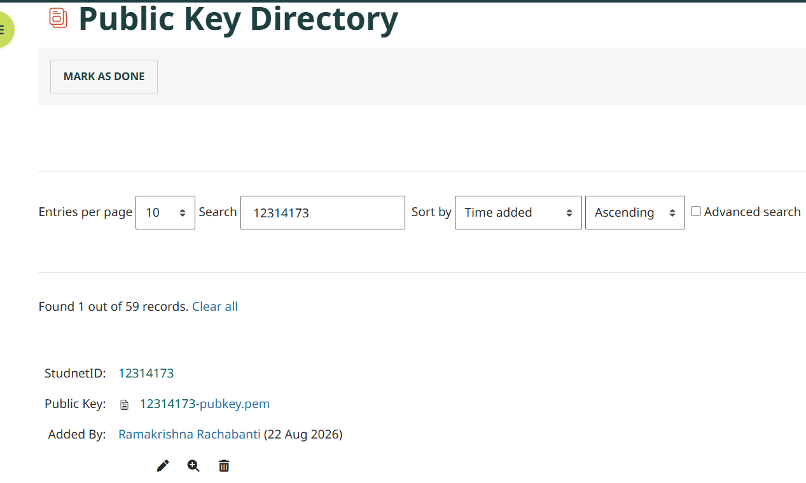

# Week 5 – Public Key Cryptography with RSA

## Introduction

In Week 5, I explored public key cryptography and its use for confidentiality, authentication and digital signatures. The practical activities focused on using OpenSSL with RSA public and private keys. I also worked with RSA key generation, public key sharing, digital signatures and signature verification.

The activities helped me understand the difference between public and private keys, how public keys can be safely shared, and how digital signatures can be used to verify the authenticity and integrity of a message.

## Task 1 – Public Key Cryptography Concepts

### Objective

The objective of this task was to understand how public and private keys are used for confidential communication and how digital signatures can be used to verify the sender of a message.

### Confidential Message to My Friend

If I want to send a confidential message to my friend, I encrypt the message using **my friend's public key**. My friend can then decrypt the message using their corresponding private key.

### Confidential Message Sent to Me

If my friend wants to send a confidential message to me, they encrypt the message using **my public key**. I can then decrypt the message using my corresponding private key.

### Verifying a Message from My Friend

To make sure that a confidential message really came from my friend, my friend signs the message using **their private key**. I verify the digital signature using **my friend's public key**.

This allows me to verify the authenticity and integrity of the received message.

### Result

I understood how public and private keys are used for confidentiality and how digital signatures can be used to authenticate the sender and verify message integrity.

## Task 2 – Public Key Cryptography with RSA

### Objective

The objective of this task was to use OpenSSL to generate and examine a 2048-bit RSA public/private key pair, share the public key, create a digital signature using RSA and SHA-256, and verify a message and signature received from another student.

## Task 2 – Public Key Cryptography with RSA

### Objective

The objective of this task was to use OpenSSL to generate and examine a 2048-bit RSA key pair, identify important RSA parameters, share the public key, and use RSA with SHA-256 for digital signatures and signature verification.

### RSA 2048-bit Key Pair Generation

I used OpenSSL in Kali Linux to generate a 2048-bit RSA private key.

The following command was used:

`openssl genrsa -out private.pem 2048`

I then extracted the public key from the private key using:

`openssl rsa -in private.pem -pubout -out public.pem`

This created two files:

- `private.pem` – contains the private RSA key and must be kept secret.
- `public.pem` – contains only the public RSA key and can be shared with other users.

*Figure 1: Generation of my 2048-bit RSA key pair and creation of the public key file.*

### RSA Public Exponent

I examined the RSA private key parameters using:

`openssl rsa -in private.pem -text -noout`

The output showed that the RSA key size was **2048 bits** and the public exponent was:

**e = 65537 (0x10001)**

*Figure 2: RSA key information showing the 2048-bit key and public exponent of 65537.*

### RSA Public Modulus

I displayed the RSA modulus using:

`openssl rsa -in private.pem -noout -modulus`

My RSA key is 2048 bits long. Therefore, the public modulus is:

**2048 / 8 = 256 bytes**

Hence, the public modulus `n` is **256 bytes**.

*Figure 3: RSA modulus displayed using OpenSSL.*

### Public Key File

The `public.pem` file contains only my RSA public key. I displayed the file to confirm its contents.

*Figure 4: RSA public key stored in the public.pem file.*

### Uploading the Public Key

I uploaded my public key to the Moodle Public Key Directory so that other students could obtain the public key without receiving my private key.

My uploaded entry contains:

- Student ID: **12314173**
- Public key: `12314173-pubkey.pem`

*Figure 5: My RSA public key uploaded to the Moodle Public Key Directory.*

I also obtained the public key belonging to Student ID **12307888** from the Public Key Directory for the partner activity.

*Figure 6: Public key of Student ID 12307888 available in the Moodle Public Key Directory.*

### Message Creation

I created a plaintext message file named:

`message-12314173.txt`

This message file was prepared for the RSA digital signature activity.

*Figure 7: Creation of message-12314173.txt for the digital signature activity.*

### Private Key Security

The RSA private key must remain confidential because it is used to perform operations such as creating my digital signature. I did not share or upload my `private.pem` file to the Public Key Directory. Only my public key was shared.

The private key should be stored securely and access should be restricted to its owner. If another person obtained the private key, they could potentially create signatures that appear to have been generated by the legitimate owner.

### Security and Convenience of Sharing Public Keys

Sharing a public key is convenient because the public key is designed to be distributed and does not need to be kept secret. In this activity, the Moodle Public Key Directory provided a convenient location for obtaining another student's public key.

However, the authenticity of a public key is important. If an incorrect or malicious public key was substituted for the intended person's key, communications or signature verification could be affected. Therefore, the identity associated with a public key should be verified through a trusted method.

### Current Result

I successfully generated a 2048-bit RSA key pair, identified the public exponent as **65537**, determined that the 2048-bit modulus is **256 bytes**, extracted my public key and uploaded the public key to the Moodle Public Key Directory. I also obtained my partner's public key and created the message file required for the digital signature activity.
