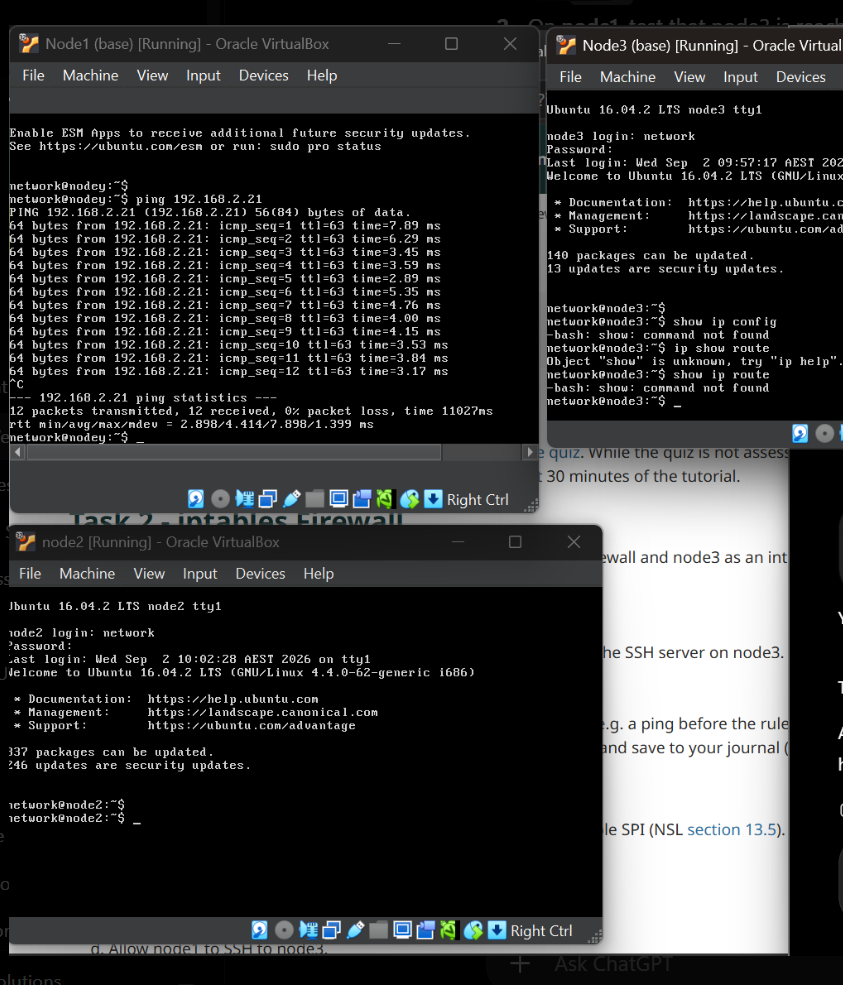
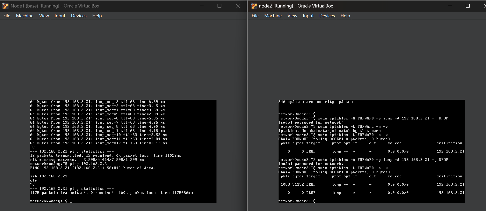
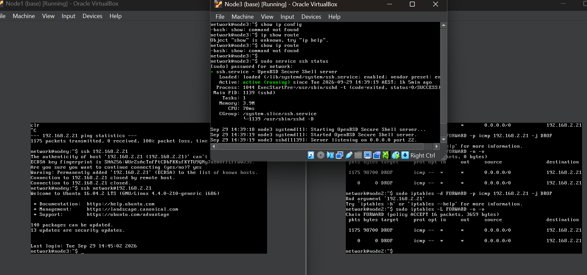
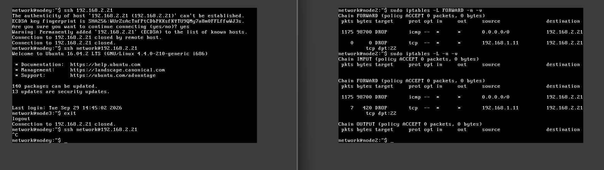
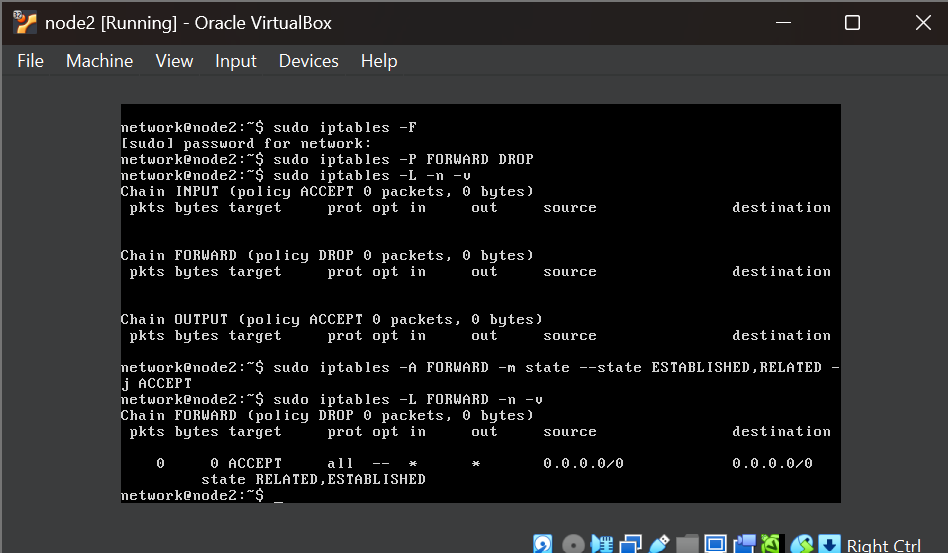
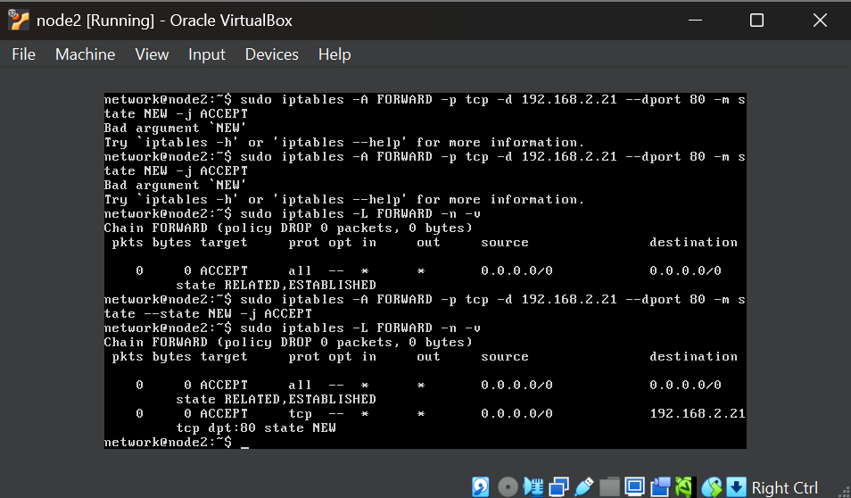
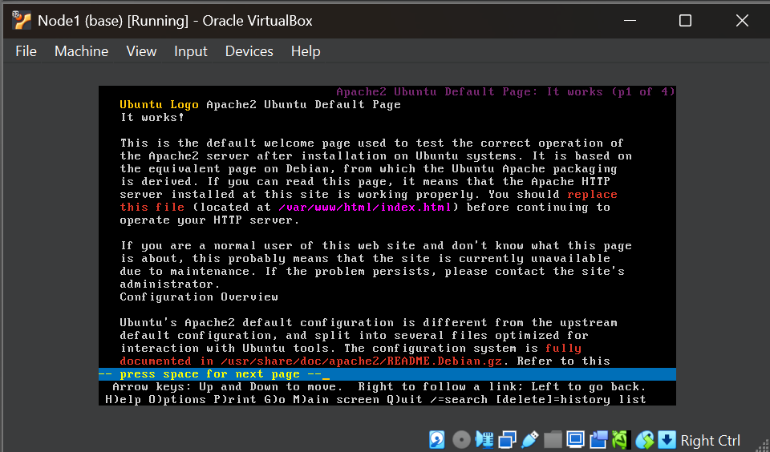
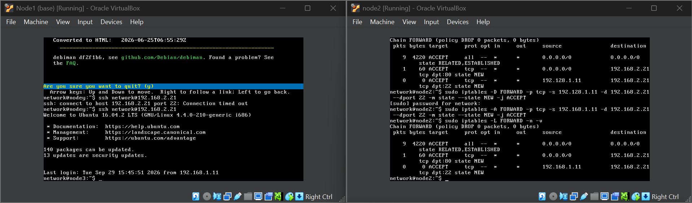
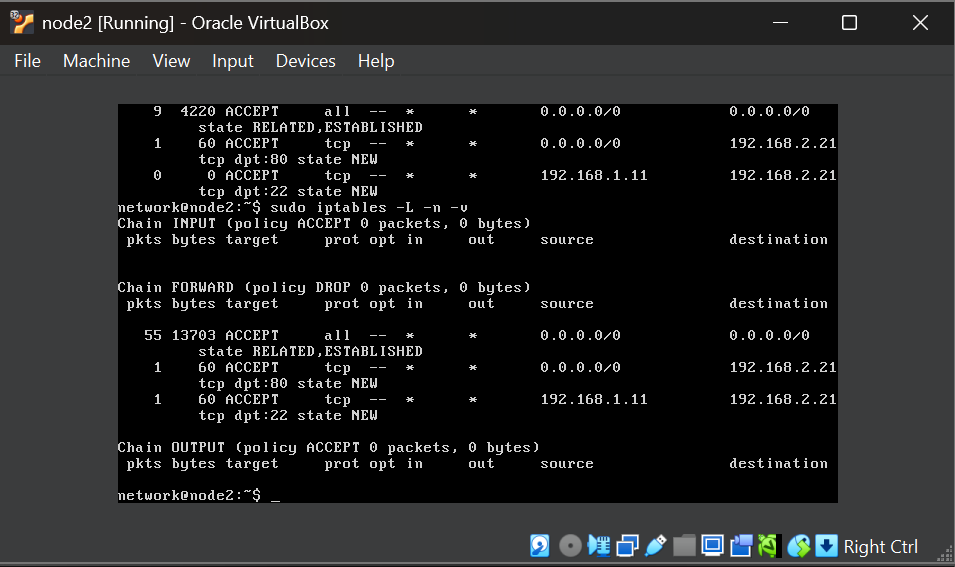

# Week 6 – Firewall Configuration with iptables

## Overview

In Week 6, I worked with Linux firewall configuration using `iptables` in the virtnet Topology 5 environment. The practical activities focused on controlling traffic passing through a firewall, testing firewall rules, and implementing Stateful Packet Inspection (SPI).

The topology consisted of:

- **node1** – external host (`192.168.1.11`)
- **node2** – firewall/router
- **node3** – internal host (`192.168.2.21`)

The activities included blocking ICMP and SSH traffic, changing the firewall default policy to DROP, enabling stateful inspection, and selectively allowing HTTP and SSH connections.

---

## Task 1 – Firewall Practice Questions

The tutorial included firewall practice questions covering packet filtering and firewall rule behaviour. These questions helped reinforce the concepts required for configuring `iptables` rules in the following practical activities.

---

# Task 2 – iptables Firewall

## Objective

The objective of this task was to configure `iptables` on node2 to control traffic between the external network and the internal host while keeping the default firewall policy as `ACCEPT`.

The firewall was configured to:

1. Block external hosts from pinging node3.
2. Block external host `192.168.1.11` from accessing the SSH server on node3.
3. Test the rules and examine firewall statistics.

---

## Initial Ping Test

Before applying the ICMP firewall rule, I tested connectivity from node1 to node3.

Command used on node1:

`ping 192.168.2.21`

The initial ping was successful, confirming that node1 could communicate with node3 before the firewall restriction was applied.

*Figure 1: Successful ping from node1 to node3 before applying the ICMP firewall rule.*

---

## Blocking Ping to node3

On node2, I added an `iptables` rule to block ICMP traffic being forwarded to node3.

Command used:

`sudo iptables -A FORWARD -p icmp -d 192.168.2.21 -j DROP`

The rule uses the `FORWARD` chain because node2 is forwarding traffic between node1 and node3.

After applying the rule, I tested the ping again from node1.

The result showed:

`0 received, 100% packet loss`

This confirmed that the ICMP traffic was successfully blocked by the firewall.

*Figure 2: Ping from node1 to node3 blocked by the ICMP DROP rule on node2.*

---

## SSH Access Before Blocking

Before applying the SSH blocking rule, I tested SSH access from node1 to node3.

Command used on node1:

`ssh network@192.168.2.21`

The SSH connection was successful and node1 was able to log in to node3.

*Figure 3: Successful SSH connection from node1 to node3 before applying the SSH firewall restriction.*

---

## Blocking SSH from node1

I then configured node2 to block SSH connections specifically from external host `192.168.1.11` to node3.

Command used:

`sudo iptables -A FORWARD -p tcp -s 192.168.1.11 -d 192.168.2.21 --dport 22 -j DROP`

This rule matches:

- TCP traffic
- Source: `192.168.1.11`
- Destination: `192.168.2.21`
- Destination port: `22` (SSH)

After applying the rule, the SSH connection from node1 no longer succeeded.

*Figure 4: SSH connection from node1 to node3 blocked by the firewall rule.*

---

## Firewall Rules and Statistics

I displayed the active firewall rules and associated packet statistics using:

`sudo iptables -L -n -v`

The rules showed that ICMP traffic to node3 was being dropped and SSH traffic from `192.168.1.11` to node3 on TCP port 22 was also being dropped.

### Task 2 Result

The Task 2 firewall configuration worked successfully. node1 could initially ping and SSH to node3, but after the firewall rules were applied, ICMP traffic and SSH traffic matching the configured conditions were blocked.

This demonstrated how `iptables` can filter forwarded traffic based on protocol, source address, destination address and destination port.

---

# Task 3 – Stateful Packet Inspection with iptables

## Objective

The objective of this task was to configure node2 as a stateful firewall using Stateful Packet Inspection (SPI).

The previous Task 2 rules were removed, the default `FORWARD` policy was changed to `DROP`, and only specifically authorised connections were allowed.

The required traffic was:

- HTTP access from external hosts to node3.
- SSH access from node1 to node3.
- Return traffic belonging to established or related connections.

---

## Resetting the Firewall and Setting Default DROP

I first flushed the existing Task 2 rules.

Command used:

`sudo iptables -F`

I then changed the default `FORWARD` policy to DROP:

`sudo iptables -P FORWARD DROP`

This meant forwarded traffic would be blocked unless an explicit ACCEPT rule allowed it.

I verified the firewall using:

`sudo iptables -L -n -v`

---

## Enabling Stateful Packet Inspection

I added a rule to allow packets that belong to connections that are already established or related to an existing connection.

Command used:

`sudo iptables -A FORWARD -m state --state ESTABLISHED,RELATED -j ACCEPT`

This rule allows return traffic for connections that were previously permitted by the firewall.

*Figure 5: Task 2 rules flushed, default FORWARD policy set to DROP, and the ESTABLISHED/RELATED SPI rule configured.*

---

## Allowing HTTP Access to node3

I created a firewall rule that allows new HTTP connections to the Apache web server running on node3.

Command used:

`sudo iptables -A FORWARD -p tcp -d 192.168.2.21 --dport 80 -m state --state NEW -j ACCEPT`

The rule allows new TCP connections to:

- Destination: `192.168.2.21`
- Destination port: `80`
- Connection state: `NEW`

*Figure 6: Stateful firewall rule allowing new HTTP connections to node3 on TCP port 80.*

---

## Testing HTTP Access

I started the Apache web server on node3 and tested access from node1.

Apache was started using:

`sudo service apache2 start`

On node1, I accessed the web server using:

`lynx http://192.168.2.21`

The Apache2 Ubuntu default page loaded successfully, confirming that HTTP traffic was allowed through the stateful firewall.

*Figure 7: Successful access to the Apache web server on node3 from node1 through the firewall.*

---

## Allowing SSH from node1

I then created a stateful rule allowing node1 to establish a new SSH connection to node3.

Command used:

`sudo iptables -A FORWARD -p tcp -s 192.168.1.11 -d 192.168.2.21 --dport 22 -m state --state NEW -j ACCEPT`

The rule allows:

- Source: `192.168.1.11`
- Destination: `192.168.2.21`
- Protocol: TCP
- Destination port: `22`
- Connection state: `NEW`

I tested the rule from node1 using:

`ssh network@192.168.2.21`

The SSH connection was successful and the terminal changed to the node3 prompt.

*Figure 8: Successful SSH connection from node1 to node3 after applying the stateful SSH firewall rule.*

---

## Final Firewall Rules and Statistics

I displayed the final firewall configuration using:

`sudo iptables -L -n -v`

The final configuration showed:

- Default `FORWARD` policy set to `DROP`.
- `ESTABLISHED,RELATED` traffic allowed.
- New HTTP connections to node3 on TCP port 80 allowed.
- New SSH connections from `192.168.1.11` to node3 on TCP port 22 allowed.
- Packet and byte counters showing that the firewall rules were being used.

*Figure 9: Final stateful firewall rules and packet statistics on node2.*

---

# Week 6 Outcome

In this tutorial, I configured packet-filtering and stateful firewall rules using `iptables`. I first used a default ACCEPT policy and created DROP rules to block ICMP and SSH traffic. I then removed those rules and configured a more restrictive firewall using a default DROP policy.

Stateful Packet Inspection was implemented using the `ESTABLISHED,RELATED` connection states. Specific rules were then created to allow new HTTP and SSH connections while other forwarded traffic remained blocked by default.

The practical activities demonstrated how firewall behaviour changes depending on rule order, protocol, IP addresses, ports and connection state. I also verified each configuration through connectivity testing and examined packet and byte statistics using `iptables -L -n -v`.
